# ETL com Pentaho

## Objetivo 

Projeto desenvolvido como solução ao desafio proposto no segundo módulo (módulo de armazenamento de dados) do bootcamp de Engenheiro de Dados do IGTI (Instituto de Gestão e Tecnologia da Informação). O objetivo principal deste exercício é fazer um processo de ETL simplificado no Pentaho a partir de arquivos do tipo csv.

## Enunciado do Desafio adaptado

Modelar um Data Warehouse simples através de diferentes arquivos ("Categoria.csv", "Cliente.csv", "Funcionario.csv", "Produto.xlsx", "Regiao.csv", "Territorio.csv", "Vendas.xlsx") que servirão como dados de origens para o DW. Estes dados seguem o seguinte modelo:

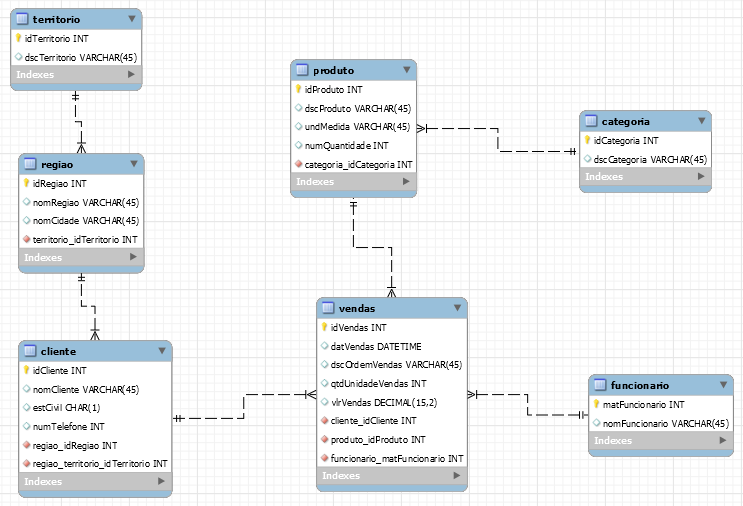

A partir dos dados de origem, o objetivo é modelar um Star Schema como esquema abaixo:

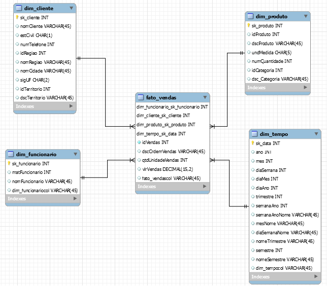

### Utilizando o MySQL como Staging e DW:

Utilizar o MySQL via Workbench como repositório para a origem dos dados.

Serão necessários dois schemas diferentes, um para a Staging e outro para o DW. Crie os schemas no MySQL manualmente ou via comando sql:

Exemplo: 

​	CREATE SCHEMA IF NOT EXISTS 'stage' DEFAULT CHARACTER SET utf8 ;

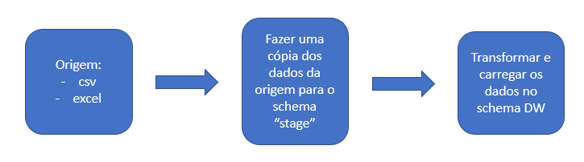

#### Criando um repositório para o projeto do desafio.

1. Clique no botão "connect" do Pentaho:

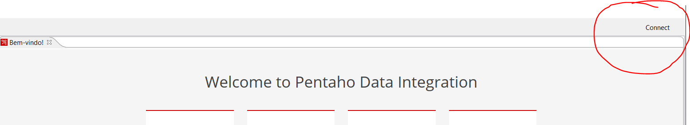

2. Em seguida, clique em "Other Repositories":

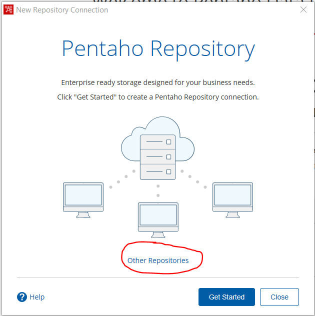

3. Selecione "File Repository" e clique em "Get Started". 

   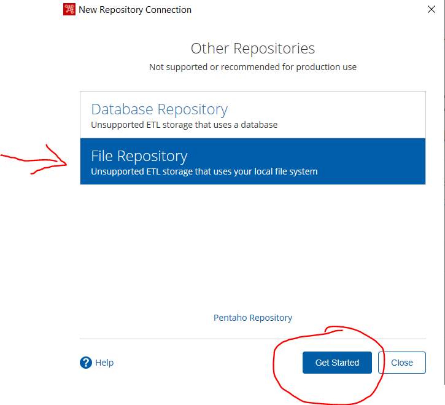

4. Configure com o diretório de sua preferência para mandar o projeto salvo.

5. Copie as transformações anexadas ao desafio para o diretório criado que servirá como repositório:

   * Origem.ktr
   * Dimensao_Data.ktr
   * Dimensao_Produto.ktr

6. Crie as conexões com os bancos MySQL:

   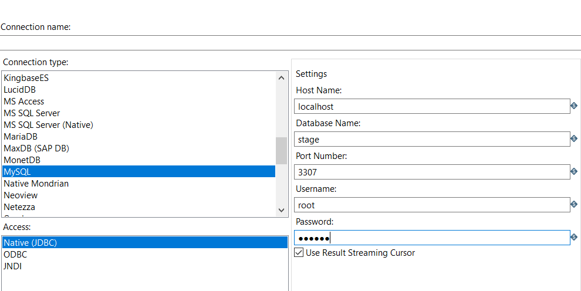

   Obs.: Vamos utilizar o arquivo disponível no desafio chamado "origem.ktr" para trabalhar com as transformações, trazendo os dados da origem para a stage. Abra esse arquivo no Pentaho.

7. Faça as seguintes alterações:

   a. Altere os steps "CSV file input" para que apontem para o arquivo de origem.

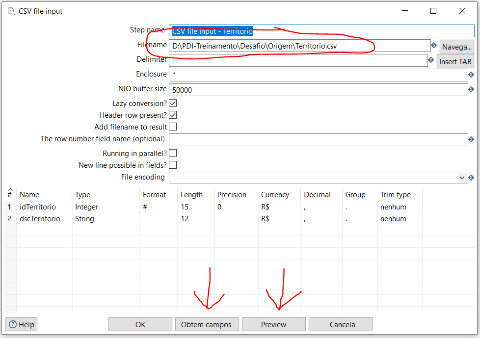

​		b. Altere os steps Table Output para que:

​			i. Ajuste a conexão de forma que funcione conectada ao MySQL Workbench.

​			ii. Aponte para o schema que receberá as tabelas da Staging.

​		c. O nome da tabela a ser criada no banco de dados é o nome que está no campo Target table. Portanto, é só clicar no botão SQL que será possível criar a tabela. 

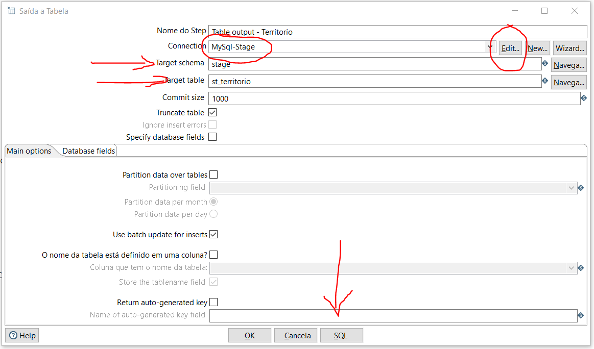

Obs.: Não é necessário criar as tabelas da Stage e do DW nos bancos MySQL de forma manual. Isso pode ser feito através do componente table output do Pentaho.

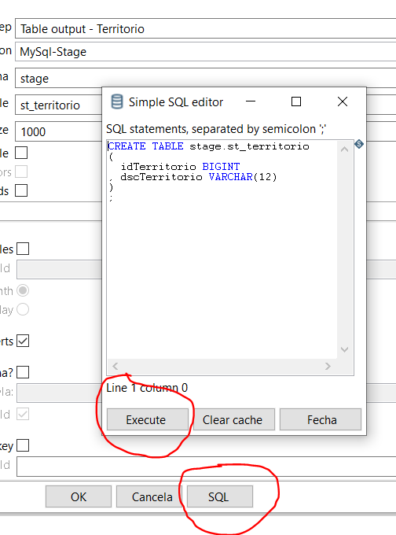

Portanto, a transformação ficará assim:

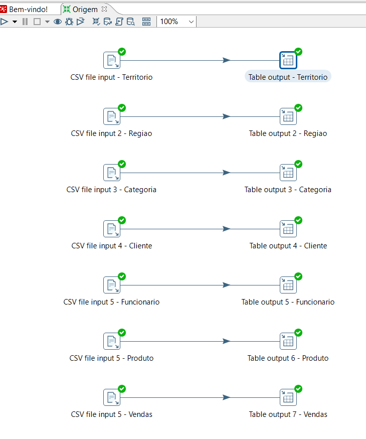

#### Carga para Dimensão Produto.

1. Abrir no Pentaho o arquivo "Dimensao_Produto.ktr";
2. Alterar as conexões dos steps Table Input para Produto e Categoria;
3. Avaliar as configurações de cada step presente;
4. Rodar a transformação.

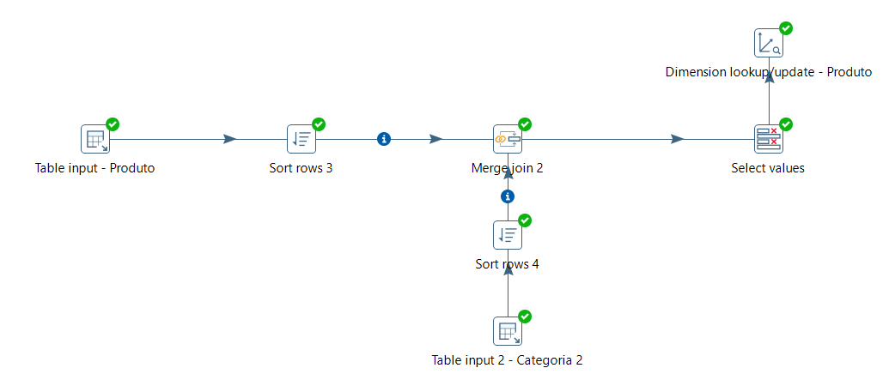

### Carga para Dimensão Tempo

1. Abrir no Pentaho o arquivo "Dim_Tempo.ktr";
2. Alterar as conexões do Table Output chamado DIM_Tempo;
3. Avaliar as configurações de cada step presente;
4. Rodar a transformação.

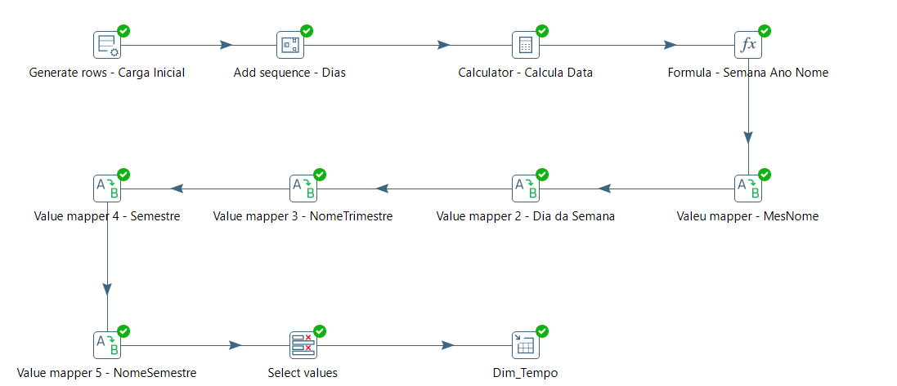

### Carga para Dimensão Funcionário

Fazer a transformação baseada no seguinte modelo.

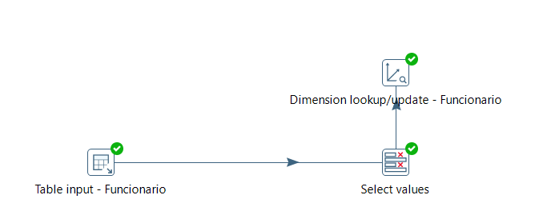

### Carga para Dimensão Cliente

Fazer a transformação baseada no seguinte modelo.

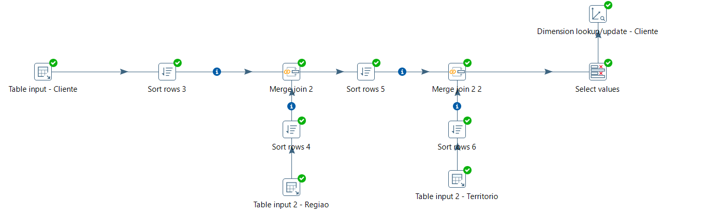

### Carga da tabela Fato Venda

Configurar a transformação conforme o modelo abaixo.

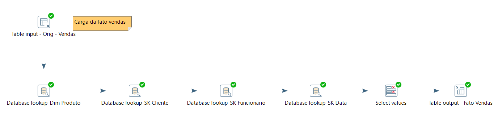

Obs.: Os steps "lookup" devem ser configurados conforme exemplo do Database lookup-SK-Cliente:

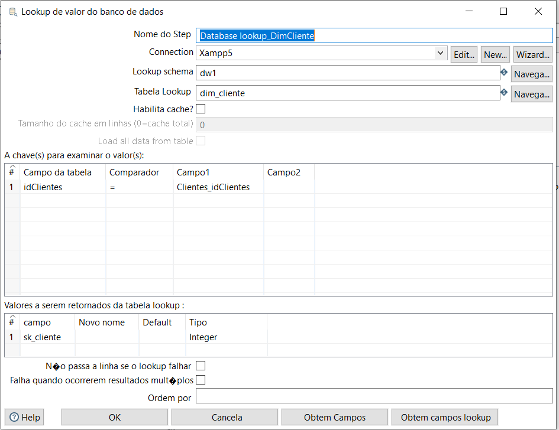

Repare, pelo "preview", que nas últimas linhas da tabela fato a sk_produto está nula. Isso não deu erro porque a tabela fato não está com as surrogate keys das dimensões setada como chave.

Vamos fazer um ajuste e ver o que acontece.

Rode o comando sql no banco de dados do schema onde está o DW.

​	ALTER TABLE 'fato_vendas' 

​		ADD PRIMARY KEY ('sk_produto', 'sk_cliente', 'sk_funcionario', 'sk_data');

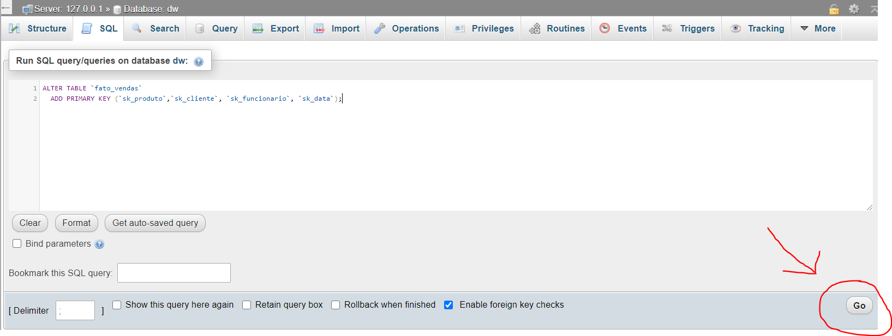

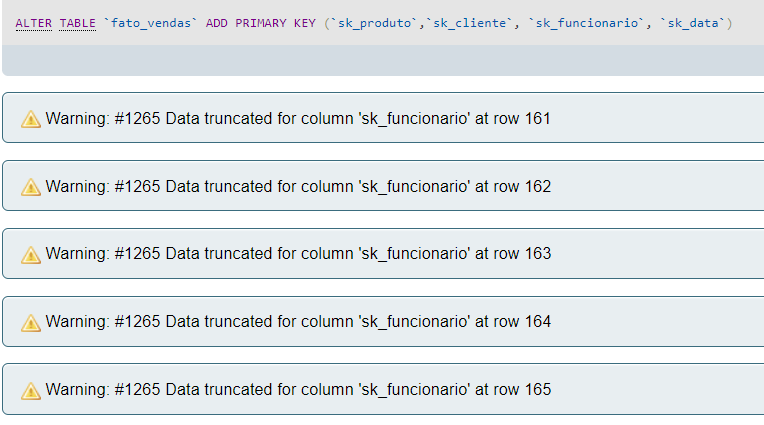

Agora que ligamos as chaves primárias na fato, tente rodar a carga da fato novamente. Você vai obter o erro: "Column 'sk_funcionario' cannot be null".

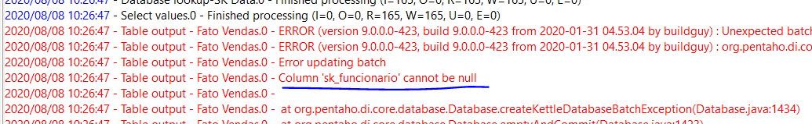

Isso será resolvido trocando o step "table output" por um step "insert update".

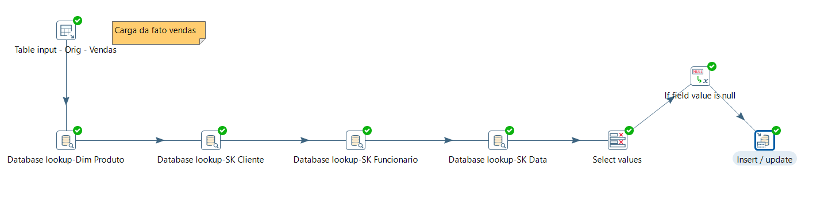

Vamos configurar quais são as chaves na tabela, e isso vai permitir fazer um update em caso de insert sem sucesso.

Repare que as dimensões do primeiro registro tem a **Surrogate Key = 1 e demais registros vazios**. Ele serve para você utilizá-lo em caso de inconsistência. Portanto, vamos utilizar o atributo SK = 1 para o caso de erro na carga.

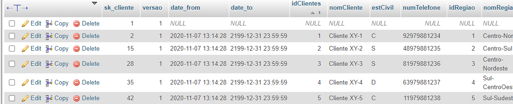

Teremos que inserir um step "**if field is null**". Configure conforme figura abaixo.

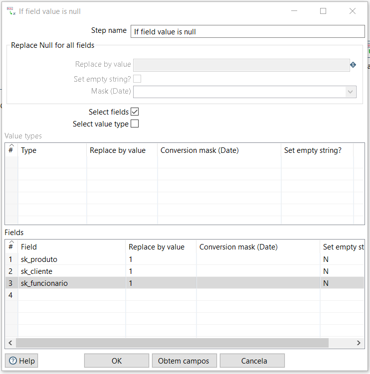

No caso de termos valores nulos para as surrogate keys, vamos atribuir um valor = 1 para eles.

Lembrando que o Pentaho reserva o primeiro registro com a SK = 1. Os campos são nulos nessa linha e ele serve exatamente para tratar erros como acima.

Configure o step "insert / update" conforme figura abaixo.

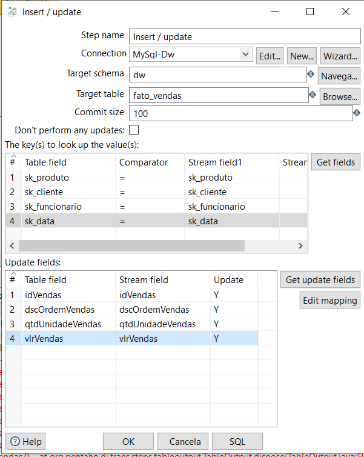

Rode a carga e depois confira o resultado no MySQL. Verifique que as últimas linhas tem sk_funcionario com valores = 1. Ou seja, há dados na tabela fato referenciando dados nas dimensões, porém esses dados na dimensão estão ausentes.

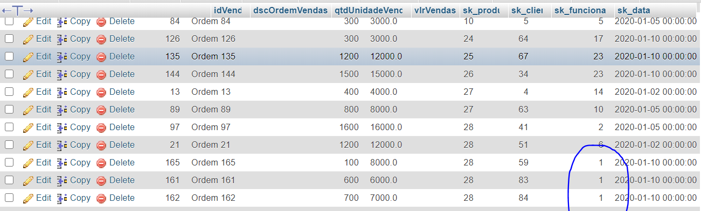

Se tentar rodar novamente a carga da tabela fato, como ela faz um processo de insert, ocorrerá erro na carga por conta da chave primária. 

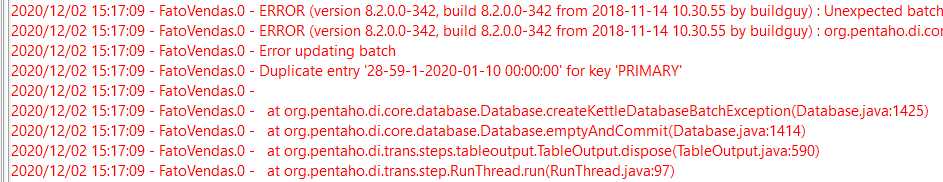

Isso pode ser resolvido pelo uso do step Dummy (do nothing):

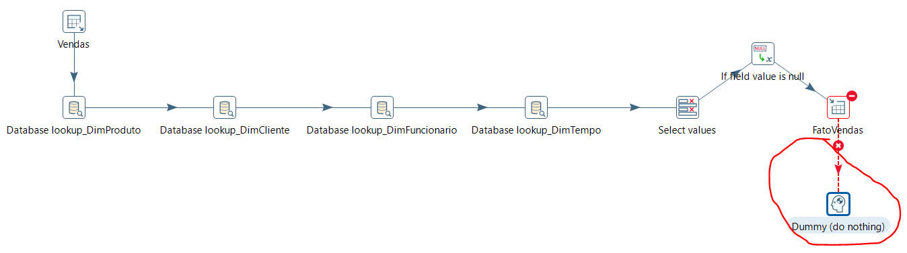

Ou então pode ser utilizado um step Insert/update ao invés do step Table output.

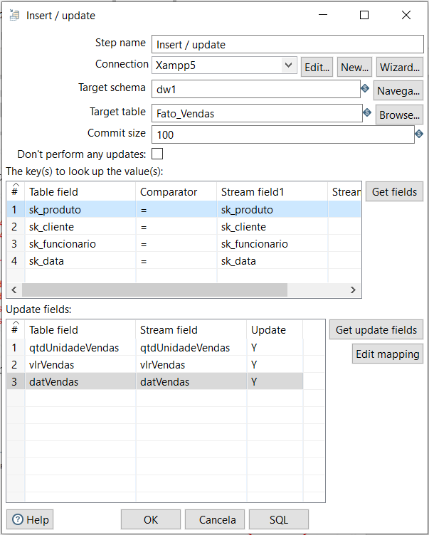

Desabilite o Hop que vai para o step Table output (Fato Vendas) e rode duas vezes para ver se dá erro.

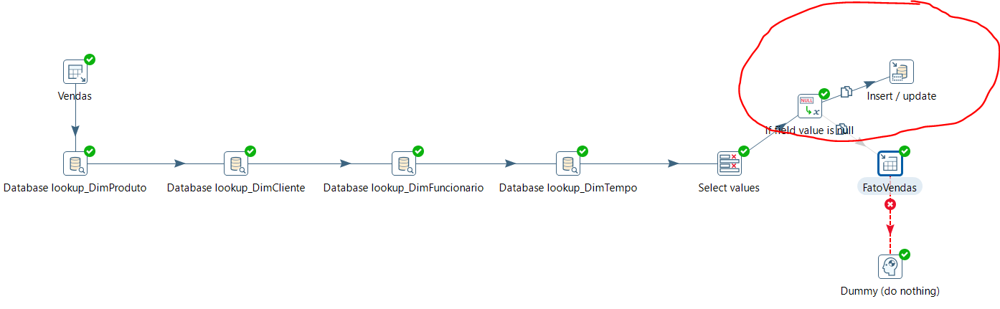

FIM.